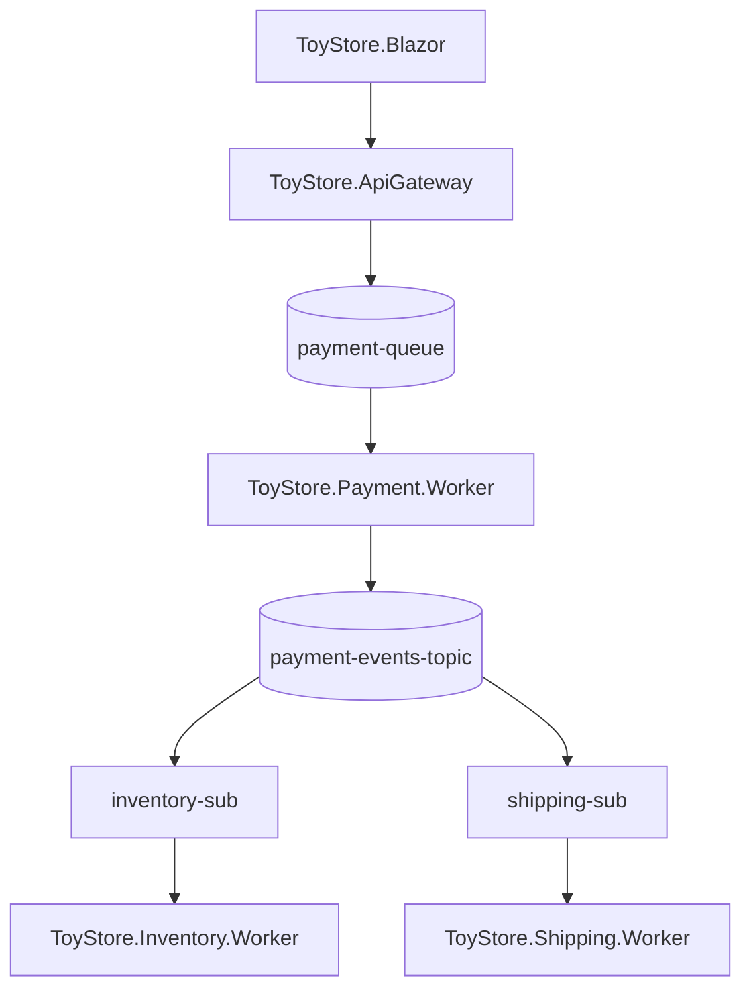

# Guia de Execução — ToyStore

Este documento explica **como executar o projeto ToyStore localmente**, passo a passo.

> Se você quer entender **o que é o Azure Service Bus e por que ele é usado aqui**, consulte o [README.md](./README.md) principal. Este guia é só sobre configuração e execução.

---

## 1. Pré-requisitos

| Item | Finalidade |
|---|---|
| **.NET 8 SDK** | Compilar e executar todos os projetos da solução |
| **Visual Studio 2022** (ou VS Code) | Editar o código e rodar múltiplos projetos ao mesmo tempo |
| **Git** | Clonar o repositório |
| **Conta no Azure** (camada gratuita/pay-as-you-go serve) | Criar o namespace do Service Bus |
| **Namespace do Azure Service Bus criado** | É o "servidor" de mensageria que a aplicação usa |
| **Pacotes NuGet restaurados** | Garantir que todas as dependências dos projetos estejam disponíveis |

---

## 2. Clonar o projeto

```bash
git clone https://github.com/SEU_USUARIO/ToyStore.git
cd ToyStore
```

---

## 3. Criando o Azure Service Bus

1. Acesse o [Portal do Azure](https://portal.azure.com).
2. Pesquise por **Service Bus** e clique em **Criar**.
3. Preencha:
   - **Namespace name**: um nome único (ex: `toystore-servicebus-seunome`).
   - **Pricing tier**: escolha **Standard** — o plano **Basic** não suporta Topics, e o projeto depende deles.
4. Clique em **Review + create** e aguarde a criação (leva poucos minutos).

---

## 4. Criando as entidades do Service Bus

Depois que o namespace estiver pronto, entre nele no Portal e crie as entidades abaixo.

### Queues

| Nome | Finalidade |
|---|---|
| `payment-queue` | Recebe o comando para processar o pagamento de um pedido recém-criado |

**Portal Azure → Queues → + Queue → nome `payment-queue` → Create**

---

### Topics

| Nome | Finalidade |
|---|---|
| `payment-events-topic` | Anuncia que um pagamento foi aprovado, para que outros serviços possam reagir |

**Portal Azure → Topics → + Topic → nome `payment-events-topic` → Create**

---

### Subscriptions

Dentro do tópico `payment-events-topic`, crie duas subscriptions:

| Nome | Finalidade |
|---|---|
| `inventory-sub` | Permite que o serviço de estoque receba o evento de pagamento aprovado |
| `shipping-sub` | Permite que o serviço de envio receba o mesmo evento, de forma independente |

Ambas recebem **a mesma mensagem**, cada uma com sua própria cópia — é assim que um único evento consegue disparar duas ações diferentes (reservar estoque e preparar envio) sem que um processo dependa do outro.

**Portal Azure → Topics → payment-events-topic → Subscriptions → + Subscription → criar `inventory-sub` e `shipping-sub`**

---

## 5. Obtendo a Connection String

1. No Portal, entre no seu **Namespace** do Service Bus.
2. No menu lateral, acesse **Shared access policies**.
3. Clique em **RootManageSharedAccessKey**.
4. Copie o campo **Primary Connection String**.

```
Namespace → Shared access policies → RootManageSharedAccessKey → Primary Connection String
```

Existem duas chaves disponíveis:

| Chave | Diferença |
|---|---|
| **Primary Connection String** | Chave principal de acesso |
| **Secondary Connection String** | Chave alternativa, útil para rotação de credenciais em produção |

Para fins de estudo, **qualquer uma das duas funciona igualmente bem**.

---

## 6. Configurando os projetos

Cole a Connection String no `appsettings.json` de cada projeto que se conecta ao Service Bus.

```json
{
  "AzureServiceBus": {
    "ConnectionString": "Endpoint=sb://SEU-NAMESPACE.servicebus.windows.net/;SharedAccessKeyName=RootManageSharedAccessKey;SharedAccessKey=SUA_CHAVE_AQUI"
  }
}
```

| Projeto | Precisa da Connection String? |
|---|---|
| `ToyStore.ApiGateway` | Sim — publica na fila `payment-queue` |
| `ToyStore.Payment.Worker` | Sim — consome `payment-queue` e publica em `payment-events-topic` |
| `ToyStore.Inventory.Worker` | Sim — consome a subscription `inventory-sub` |
| `ToyStore.Shipping.Worker` | Sim — consome a subscription `shipping-sub` |
| `ToyStore.Blazor` | Não — só se comunica com a API via HTTP |

Os nomes de filas, tópicos e subscriptions **já estão centralizados no código** (em `ToyStore.Infrastructure`), então não é necessário configurá-los no `appsettings.json` — apenas a Connection String.

---

## 7. Restaurando os pacotes

Na raiz da solução, execute:

```bash
dotnet restore
```

Esse comando baixa todas as dependências NuGet usadas pelos projetos (incluindo o SDK do Azure Service Bus e o Entity Framework Core).

---

## 8. Executando a aplicação

Não é necessário Docker nem recursos adicionais no Azure além do Service Bus — **todo o resto roda localmente**.

Abra um terminal para cada projeto abaixo e execute na ordem:

```bash
# 1. API
cd src/ToyStore.ApiGateway
dotnet run
```

```bash
# 2. Payment Worker
cd src/ToyStore.Payment.Worker
dotnet run
```

```bash
# 3. Inventory Worker
cd src/ToyStore.Inventory.Worker
dotnet run
```

```bash
# 4. Shipping Worker
cd src/ToyStore.Shipping.Worker
dotnet run
```

```bash
# 5. Blazor
cd src/ToyStore.Blazor
dotnet run
```

Os **cinco projetos precisam ficar rodando ao mesmo tempo**, cada um em seu próprio terminal (ou usando "Multiple Startup Projects" no Visual Studio).

---

## 9. Testando o fluxo completo

1. Abra o Blazor no navegador (ex: `https://localhost:5001`).
2. Navegue pelo catálogo de produtos.
3. Adicione produtos ao carrinho.
4. Finalize a compra.
5. Confirme que o pedido foi criado com sucesso (você será redirecionado para a página de confirmação).
6. Observe os logs no terminal da **API** — deve aparecer a criação do pedido e a publicação do comando de pagamento.
7. Observe os logs do **Payment Worker** — o pagamento é processado e um evento é publicado no tópico.
8. Observe os logs do **Inventory Worker** — o estoque é reservado.
9. Observe os logs do **Shipping Worker** — o envio é preparado e o pedido é finalizado.
10. Acesse a **página de monitoramento do pedido** no Blazor e acompanhe visualmente cada etapa do status mudando em tempo real.

---

## 10. Validando no Azure Portal

Enquanto a aplicação roda, você pode acompanhar o processamento diretamente no Portal:

| O que ver | Onde |
|---|---|
| Mensagens entrando/saindo da fila | Namespace → Queues → `payment-queue` → Overview |
| Mensagens publicadas no tópico | Namespace → Topics → `payment-events-topic` → Overview |
| Consumo por cada serviço | Topics → `payment-events-topic` → Subscriptions → `inventory-sub` / `shipping-sub` |
| Mensagens que falharam repetidamente | Subscription correspondente → **Dead Letter Queue** |
| Métricas básicas (throughput, erros) | Namespace → Metrics |

Isso ajuda a confirmar, de forma visual, que as mensagens estão realmente passando pelo Service Bus durante os testes.

---

## 11. Estrutura final em execução



Esse é o caminho completo de uma compra: o usuário interage com o Blazor, a API cria o pedido e publica um comando na fila de pagamento, o Payment Worker processa e anuncia o resultado no tópico, e os Workers de Estoque e Envio reagem de forma independente através de suas próprias subscriptions.

---

Pronto! Com esses passos, a aplicação completa deve estar rodando localmente, com todas as mensagens fluindo pelo Azure Service Bus.
