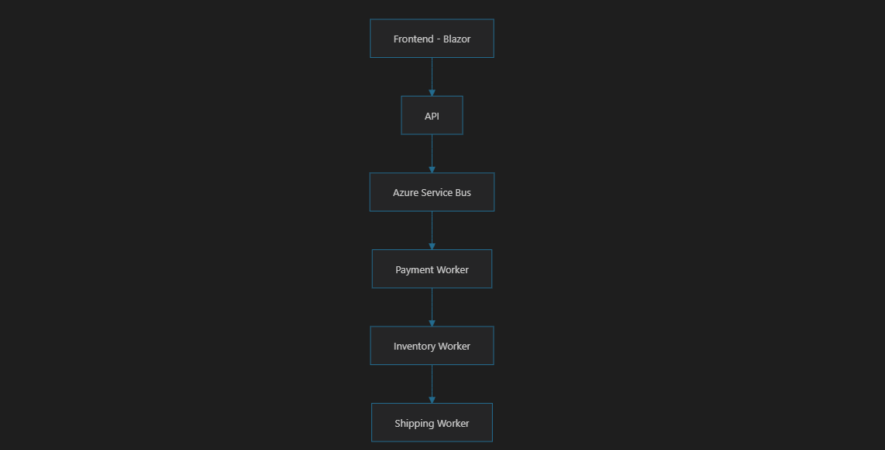
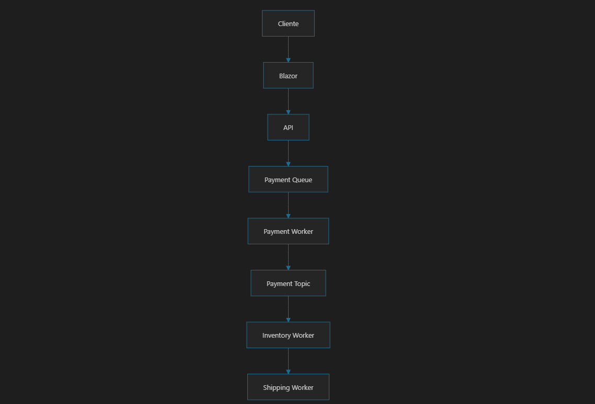
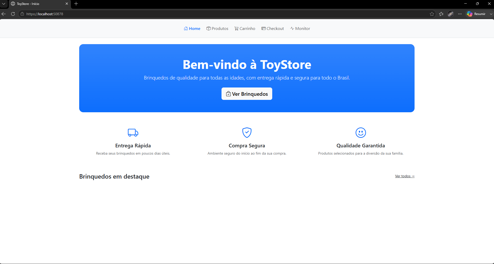
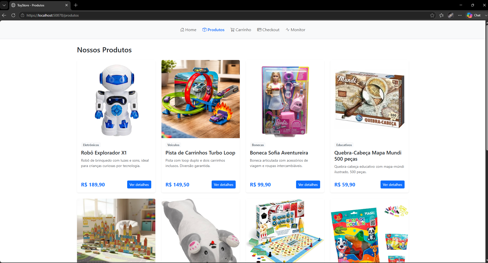
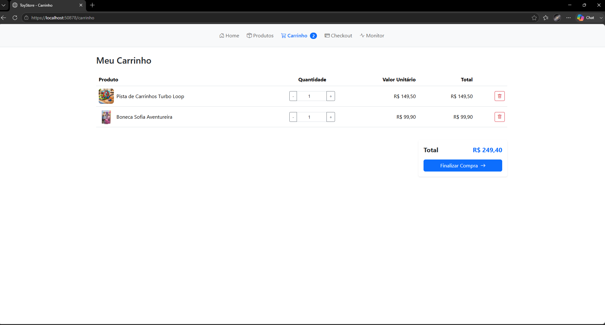
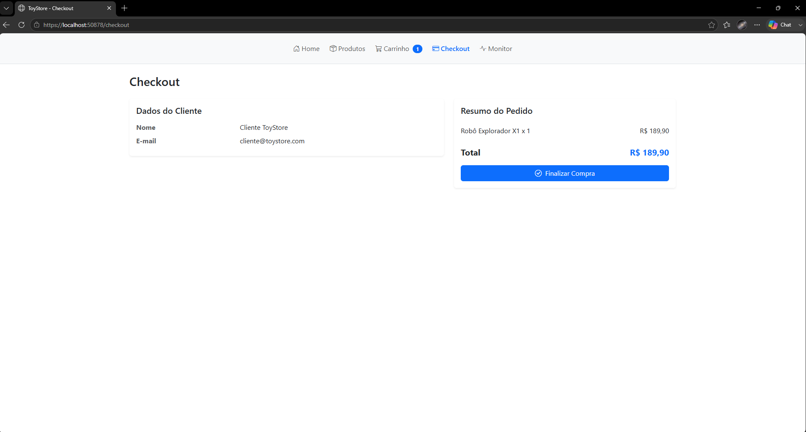
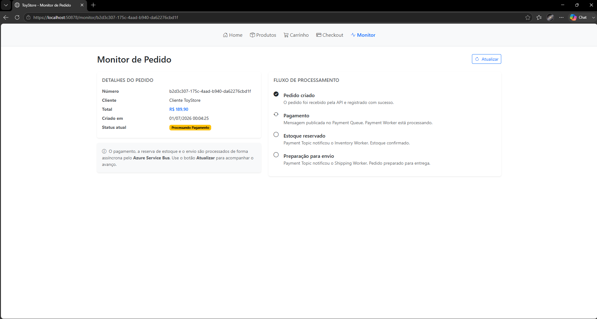
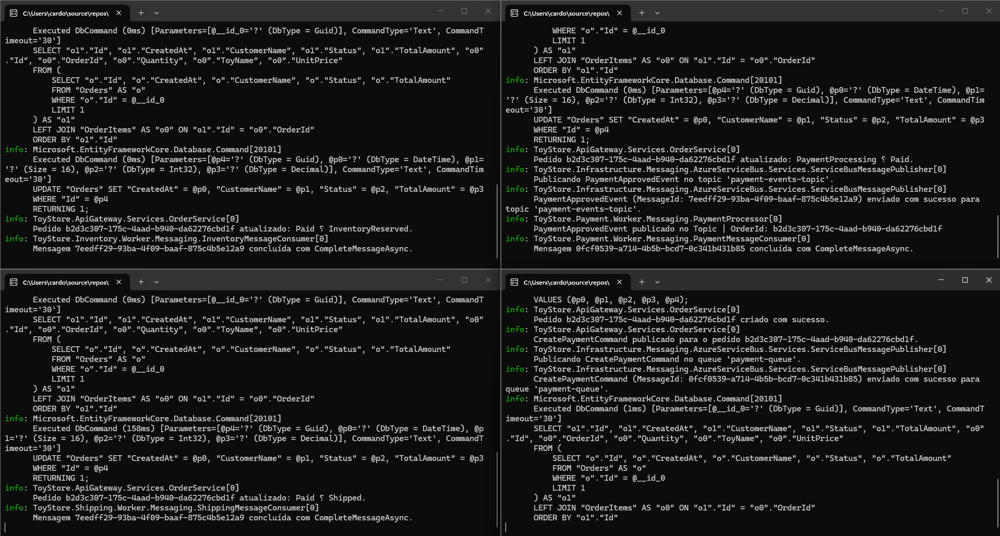
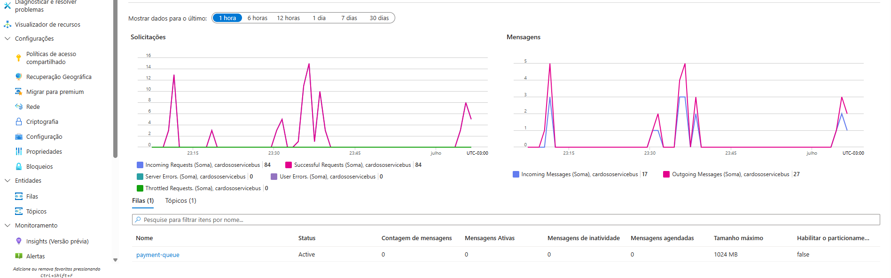
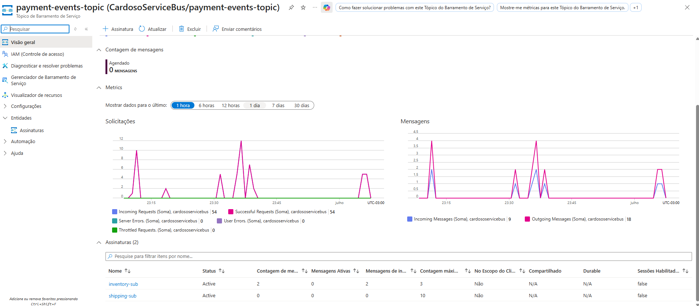

# ToyStore

E-commerce de Brinquedos desenvolvido em **.NET 8** utilizando arquitetura de **Azure Service Bus** .

---

## 🎯 Objetivo

O principal objetivo deste projeto é demonstrar, na prática, a importância da **mensageria** em aplicações modernas.

Utilizando o cenário de um e-commerce de brinquedos, o projeto mostra como operações assíncronas tornam uma aplicação mais **desacoplada** e **escalável**: o usuário final apenas cria um pedido, enquanto todo o processamento — pagamento, estoque e envio — acontece em segundo plano, orquestrado pelo Azure Service Bus.

---

## Por que utilizar Azure Service Bus?
 
Imagine uma loja durante a Black Friday. Milhares de pessoas clicam em "Comprar" quase ao mesmo tempo. E cada clique desses não é uma tarefa só — é várias:
 
* salvar o pedido;
* processar o pagamento;
* reservar o item no estoque;
* preparar o envio;
* enviar um e-mail de confirmação;
* atualizar outros sistemas internos.

Agora pense: e se a aplicação tentasse fazer tudo isso **na hora**, antes de responder ao cliente? O usuário ficaria olhando para uma tela de carregamento enquanto o sistema processa pagamento, verifica estoque, gera nota, dispara e-mail... tudo isso em sequência, um esperando o outro terminar. Com poucos pedidos, talvez nem se note. Mas com milhares acontecendo ao mesmo tempo, a aplicação começa a travar, demorar ou simplesmente cair. E ninguém quer ficar esperando o site "pensar" depois de pagar por um produto.
 
É aqui que entra a ideia de **mensageria**.
 
Pense no Azure Service Bus como um **organizador de tarefas** super eficiente. Em vez de a aplicação tentar resolver tudo sozinha, na hora, ela simplesmente anota "isso aqui precisa ser feito" e entrega essa anotação para o Service Bus. A partir daí, outros serviços — cada um especialista em uma parte do processo — pegam essas anotações e cuidam delas com calma, em segundo plano.
 
O resultado? O cliente clica em "Comprar", recebe uma confirmação quase instantânea de que o pedido foi registrado, e pode fechar a página tranquilo. Enquanto isso, por trás das cortinas, o pagamento está sendo processado, o estoque está sendo atualizado e o envio está sendo preparado — tudo de forma **assíncrona**, sem travar nada e sem fazer o cliente esperar.
 
É por isso que um e-commerce é um exemplo tão bom para o estudo de mensageria: ele tem várias tarefas independentes, que não precisam (e nem deveriam) acontecer todas ao mesmo tempo, na mesma requisição. E é exatamente esse tipo de cenário que o Azure Service Bus foi feito para resolver — e que este projeto usa como base de estudo.
 
Com essa ideia em mente, alguns termos aparecem naturalmente quando começamos a organizar esse fluxo:
 
* **Producer** — é quem "anota a tarefa". No nosso exemplo, é a API dizendo "um novo pedido acabou de ser criado".
* **Consumer** — é quem pega essa anotação e realmente faz o trabalho, como o serviço que processa o pagamento.
* **Queue** — é a fila onde as tarefas esperam a sua vez, como uma fila de pedidos esperando para serem pagos.
* **Topic** — é como uma fila, mas que pode avisar vários interessados ao mesmo tempo, como avisar o estoque e o envio que um pagamento foi aprovado.
* **Subscription** — é a forma de cada serviço "se inscrever" para receber os avisos de um Topic que interessam a ele.
* **Retry** — se algo der errado ao processar uma tarefa, o Service Bus não desiste na primeira tentativa; ele tenta de novo algumas vezes.
* **Dead Letter Queue** — se mesmo depois de várias tentativas a tarefa continuar falhando, ela vai para uma "fila de problemas", separada, para ser investigada depois, sem travar o resto do sistema.

Nas próximas seções, você vai ver como esses conceitos se encaixam na arquitetura deste projeto.

## 🏗️ Arquitetura da aplicação

| Componente | Responsabilidade |
|---|---|
| **Frontend (Blazor)** | Interface para o cliente navegar pelo catálogo, montar o carrinho e finalizar o pedido. |
| **API** | Ponto de entrada da aplicação. Recebe as requisições e publica mensagens no Service Bus. |
| **Azure Service Bus** | Intermediário de mensageria responsável por entregar as mensagens de forma assíncrona e confiável. |
| **Payment Worker** | Processa o pagamento do pedido. |
| **Inventory Worker** | Atualiza o estoque dos produtos. |
| **Shipping Worker** | Gera o envio do pedido. |

---

## 📚 Outros Conceitos do Azure Service Bus

Uma breve explicação dos principais conceitos estudados durante o desenvolvimento:

| Conceito | Descrição |
|---|---|
| **Command** | Mensagem que representa uma instrução para que algo seja feito. |
| **Event** | Mensagem que representa um fato que já ocorreu. |
| **CompleteMessageAsync** | Confirma o processamento da mensagem, removendo-a da fila. |
| **AbandonMessageAsync** | Devolve a mensagem para a fila, sinalizando falha no processamento. |
| **MaxDeliveryCount** | Limite de tentativas de entrega antes de a mensagem ser enviada para a Dead Letter Queue. |
| **Dead Letter Queue (DLQ)** | Fila especial que armazena mensagens que não puderam ser processadas após esgotar as tentativas. |
| **Reprocessamento manual** | Ação de reenviar manualmente uma mensagem presente na DLQ para nova tentativa de processamento. |

---

## 🧩 Infraestrutura do projeto

| Projeto | Descrição |
|---|---|
| **ToyStore.Blazor** | Frontend da aplicação, onde o cliente navega pelo catálogo e finaliza seus pedidos. |
| **ToyStore.ApiGateway** | API responsável por receber as requisições e publicar as mensagens no Service Bus. |
| **ToyStore.Contracts** | Biblioteca compartilhada com DTOs, enums, eventos e comandos utilizados entre os projetos. |
| **ToyStore.Infrastructure** | Biblioteca compartilhada com a implementação de acesso a dados e integração com o Service Bus. |
| **ToyStore.Payment.Worker** | Worker responsável por processar o pagamento do pedido. |
| **ToyStore.Inventory.Worker** | Worker responsável por atualizar o estoque dos produtos. |
| **ToyStore.Shipping.Worker** | Worker responsável por gerar o envio do pedido. |

---

## 🔄 Fluxo da aplicação

  

1. O cliente navega pelo catálogo e finaliza o pedido através do **Blazor**.
2. A **API** recebe a requisição e publica uma mensagem na fila de pagamento.
3. O **Payment Worker** processa o pagamento e publica um evento em um Topic.
4. O **Inventory Worker** consome o evento e atualiza o estoque.
5. O **Shipping Worker** consome o evento e gera o envio do pedido.

---

## 🖼️ Imagens da Solução

* Tela inicial da aplicação
  
* Catálogo de produtos
  
* Carrinho
  
* Checkout
  
* Página de monitoramento
  
* Consoles dos Workers
  
* Azure Service Bus (Queues, Topics e Subscriptions)
  
* Métricas/gráficos do Azure mostrando o processamento das mensagens
  

---

## 🛠️ Tecnologias utilizadas

* .NET 8
* Blazor
* ASP.NET Core Web API
* Azure Service Bus
* Entity Framework Core
* SQLite Database
* Bootstrap

---

## ✅ Pré-requisitos

* .NET 8 SDK
* Visual Studio 2022 ou VS Code
* Conta Azure
* Namespace do Azure Service Bus
* Connection String do Service Bus
* Configuração do `appsettings.json`
* Pacotes NuGet restaurados

---

## ▶️ Como executar

1. Clonar o repositório.
2. Restaurar os pacotes.
3. Configurar a Connection String do Azure Service Bus.
4. Criar as Queues, Topics e Subscriptions necessárias.
5. Executar a API.
6. Executar os Workers.
7. Executar o Blazor.
8. Criar um pedido e acompanhar o fluxo.

Para mais detalhes de como executar a aplicação acesse:
[Guia de Execução Completo](Execution.md)
---

## 🎓 Aprendizados

* Arquitetura orientada a eventos
* Mensageria
* Azure Service Bus
* Comunicação assíncrona
* Workers
* Processamento desacoplado
